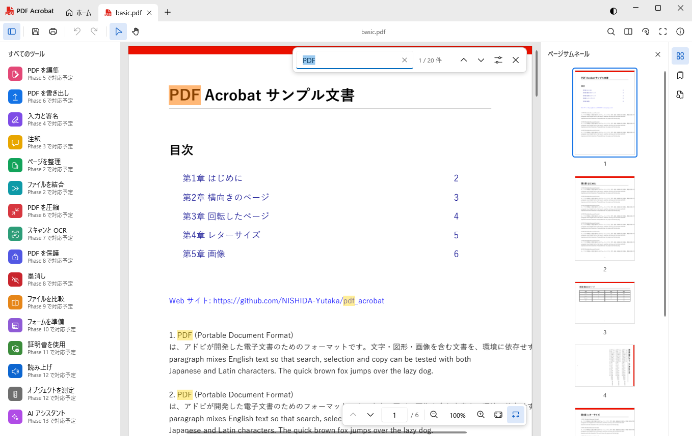
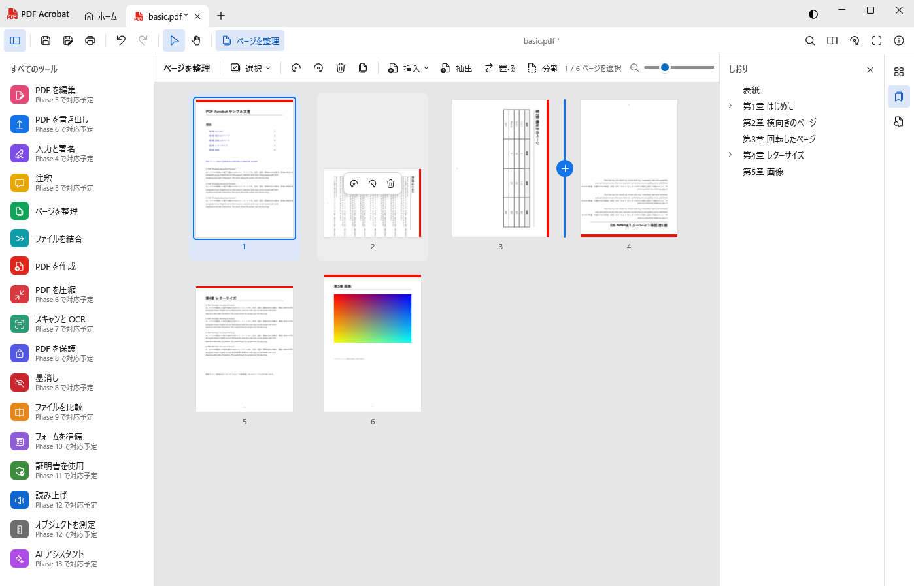

# PDF Acrobat

Adobe Acrobat を参考にした、**Windows ネイティブ**の PDF アプリケーションです（C# / .NET 10 / WPF）。

> 本プロジェクトは学習・個人利用を目的とした非公式のクローンであり、Adobe Inc. とは一切関係ありません。
> 「Adobe」「Acrobat」は Adobe Inc. の商標です。



## できること（現在）

| 分類 | 機能 |
|---|---|
| 閲覧 | 高品質描画（PDFium）、数千ページでも軽快な仮想スクロール、高倍率時のタイル描画 |
| ズーム | 拡大・縮小、幅に合わせる、ページ全体、実寸、プリセット、Ctrl＋ホイール（カーソル位置基準） |
| 表示 | 単一ページ／連続／見開き／見開き連続、表紙の別表示、表示の回転、フルスクリーン（Ctrl+L） |
| ナビゲーション | ページ番号・ページラベル、サムネイル、しおり（階層）、文書内リンク・URL リンク |
| テキスト | ドラッグ選択（ページをまたぐ選択可）、ダブルクリックで単語、トリプルクリックで行、全選択、コピー |
| 検索 | 日本語向け正規化（全角/半角・大文字/小文字・改行をまたぐ一致）、結果一覧、ハイライト |
| 印刷 | プリンター選択、部数、ページ範囲、合わせる／実寸／縮小、自動回転、グレースケール、プレビュー |
| ページ整理 | サムネイルの一覧で回転・削除・並べ替え（ドラッグ＆ドロップ）・挿入（ファイル／空白／クリップボード）・複製・コピー＆ペースト・抽出・置換・分割（ページ数／ファイル数／範囲／しおり）。すべて元に戻せる |
| 結合・作成 | 複数の PDF・画像を並べ替えて結合（ファイルごとのしおり付き）、空白ページ（用紙サイズ指定）・画像・クリップボード（画像／テキスト）から PDF を作成 |
| 保存 | 上書き保存・名前を付けて保存（安全な置き換え）、2 分ごとの自動保存と異常終了時の復元 |
| その他 | タブで複数文書、パスワード付き PDF、文書のプロパティ、最近使ったファイル、ライト／ダークテーマ |



今後の予定（注釈・入力と署名・編集・変換・OCR・墨消しなど）は [docs/FEATURES.md](docs/FEATURES.md) を参照してください。

## 必要環境

- Windows 10（1809 以降）/ Windows 11
- 開発には [.NET 10 SDK](https://dotnet.microsoft.com/download/dotnet/10.0)

## ビルドと実行

```bash
dotnet build
```

```bash
dotnet run --project src/PdfAcrobat.App
```

PDF を引数に渡すとそのファイルを開きます。

```bash
dotnet run --project src/PdfAcrobat.App -- samples/basic.pdf
```

テスト:

```bash
dotnet test
```

詳しくは [docs/DEVELOPMENT.md](docs/DEVELOPMENT.md) を参照してください。

## 主なキーボードショートカット

| キー | 操作 |
|---|---|
| Ctrl+O / Ctrl+W | 開く / タブを閉じる |
| Ctrl+N | 新規（空白ページ） |
| Ctrl+S / Ctrl+Shift+S | 保存 / 名前を付けて保存 |
| Ctrl+Z / Ctrl+Y | 元に戻す / やり直し |
| Ctrl+P | 印刷 |
| Ctrl+Shift+D / Ctrl+Shift+I / Ctrl+Shift+R | ページの削除 / ファイルの挿入 / 右に回転 |
| （ページを整理）Delete, Ctrl+A, Ctrl+C/X/V, 矢印, Enter | 削除、全選択、ページのコピー／切り取り／貼り付け、選択の移動、ページを表示 |
| Ctrl+F, F3, Shift+F3 | 検索、次へ、前へ |
| Ctrl++ / Ctrl+- | 拡大 / 縮小 |
| Ctrl+0 / Ctrl+1 / Ctrl+2 | ページ全体 / 実寸 / 幅に合わせる |
| Ctrl+L | フルスクリーン |
| Ctrl+D | 文書のプロパティ |
| F4 / Shift+F4 | サムネイル / すべてのツール |
| Space（押している間） | 手のひらツール |

## 構成

```
src/
  PdfAcrobat.Pdfium/   PDFium の P/Invoke とスレッドセーフなラッパー
  PdfAcrobat.Core/     文書モデル（ページ参照・Undo）、テキスト検索、フォント（PDFsharp 用）
  PdfAcrobat.App/      WPF アプリ（ビューア、画面、サービス）
tests/
  PdfAcrobat.Tests/    単体テスト（xUnit）
  ui/                  UI 自動確認スクリプト
tools/
  PdfAcrobat.SampleGen/ テスト用サンプル PDF の生成
docs/                  機能一覧・設計・開発メモ
```

設計の詳細は [docs/ARCHITECTURE.md](docs/ARCHITECTURE.md) にあります。

## 使用ライブラリ

| ライブラリ | 用途 | ライセンス |
|---|---|---|
| [PDFium](https://pdfium.googlesource.com/pdfium/)（[bblanchon/pdfium-binaries](https://github.com/bblanchon/pdfium-binaries)） | 描画・テキスト・ページ操作 | BSD-3-Clause / Apache-2.0 |
| [PDFsharp](https://github.com/empira/PDFsharp) | PDF の生成・書き込み | MIT |
| [WPF-UI](https://github.com/lepoco/wpfui) | Fluent デザインのコントロール | MIT |
| [CommunityToolkit.Mvvm](https://github.com/CommunityToolkit/dotnet) | MVVM | MIT |
